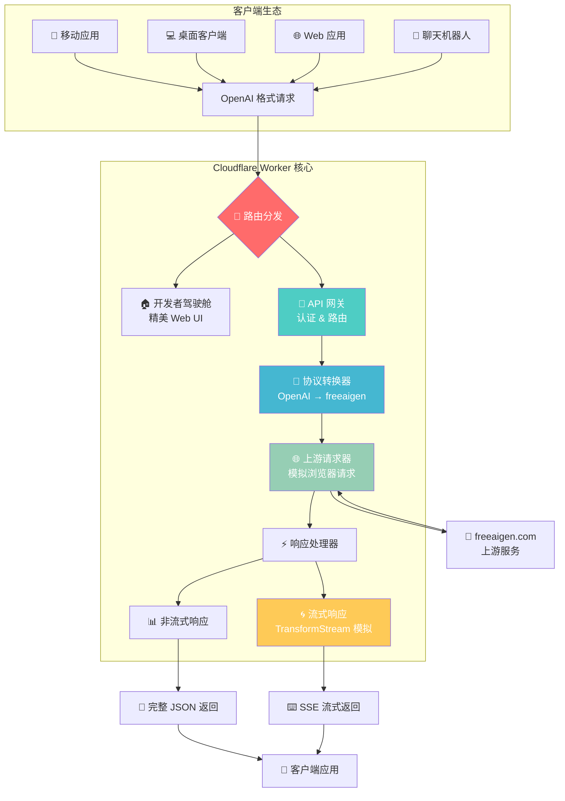
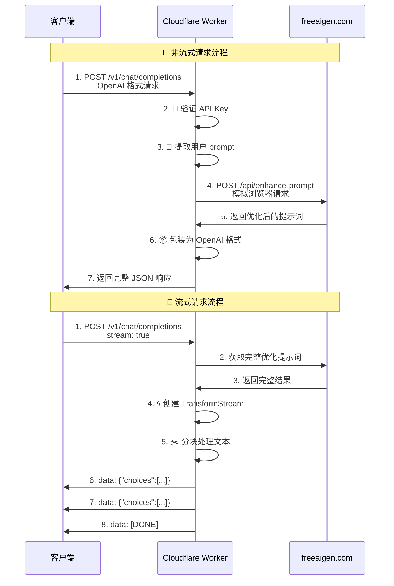

# freeaigen-2api (Cloudflare Worker 单文件版)

<div align="center">


**✨ 一个将 freeaigen.com 提示词优化服务，无损转换为 OpenAI 标准 API 的魔法炼金阵 ✨**

**"点石成金，化繁为简。我们不是代码的搬运工，我们是数字世界的炼金术士。"**

[](https://deploy.workers.cloudflare.com/?url=https://github.com/lza6/freeaigen-2api-cfwork)

</div>

---

## 🚀 高能预警：这到底是个什么神器？

简单来说，`freeaigen-2api` 是一个部署在 Cloudflare Workers 上的 **智能转换器** 或 **API 代理**。

它就像一个聪明的翻译官，把你用 OpenAI 格式说的话（比如"给我画一只猫"），转换成 `freeaigen.com` 能听懂的请求，然后把 `freeaigen.com` 精心优化后的、适用于 Midjourney/Stable Diffusion 的超长超详细英文提示词，再用 OpenAI 的格式返回给你。

**🎯 最重要的是：它完全免费，一键部署，无需服务器，无需魔法上网，还自带一个超酷的"开发者驾驶舱"UI 界面！**

## ✨ 核心亮点

<div align="center">

| 特性 | 描述 | 图标 |
|------|------|------|
| **⚡ 一键部署** | 点击按钮，30秒内拥有专属 API 服务 | 🚀 |
| **💰 零成本运行** | Cloudflare Workers 免费套餐，每天10万次请求 | 💸 |
| **🔌 OpenAI 兼容** | 无缝接入任何 OpenAI 生态应用 | 🔗 |
| **🌍 全球加速** | 部署在 Cloudflare 边缘节点，全球低延迟 | 🌐 |
| **🎮 开发者驾驶舱** | 精美 Web UI，在线测试、实时调试 | 🖥️ |
| **📡 流式传输** | 模拟"打字机"式流式响应，体验更佳 | ⌨️ |
| **📦 完全自包含** | 所有代码都在一个文件，干净清爽 | 📄 |

</div>

## 💡 项目缘起与哲学：为什么要做这个？

> "凡人皆有一死，凡代码皆有 Bug。但思想，是永恒的。" —— 首席AI执行官

我们生活在一个 AI 工具大爆发的时代，但许多优秀的小众工具因为没有提供标准化的 API，变成了"数据孤岛"。`freeaigen.com` 就是这样一个宝藏岛屿，它的提示词优化能力出色，但你只能在网站上手动使用。

**这不酷。**

`freeaigen-2api` 的诞生，源于一个简单的信念：**解放工具，连接价值**。我们相信，好的工具应该像水和电一样，能够轻松地流入任何需要它的地方。通过为其披上 OpenAI API 的"标准外衣"，我们打破了孤岛的壁垒，让它的强大能力可以被成千上万的现有应用集成调用。

这不仅仅是写代码，这是一种 **数字炼金术**。我们将一个封闭的服务，炼成了一个开放、通用、可组合的"元素"。这背后是开源精神的体现：**分享、协作、创造更大的价值**。

## 🏗️ 系统架构：魔法背后的科学

<div align="center">



</div>

## 🪄 懒人一键部署教程 (推荐)

只需轻轻一点，魔法即刻发生！

1.  **🔑 登录你的 [Cloudflare Dashboard](https://dash.cloudflare.com/)** (没有就注册一个，免费的)
2.  **🚀 点击下方按钮**：

    [](https://deploy.workers.cloudflare.com/?url=https://github.com/lza6/freeaigen-2api-cfwork)

3.  **✅ 授权并部署**：
    - Cloudflare 会请求访问你的 GitHub 仓库（只需授权一次）
    - 给你新创建的项目起个名字（例如 `my-prompt-enhancer`）
    - 点击 **"部署"**

4.  **🔒 设置密钥（重要！）**：
    - 部署成功后，进入你的 Worker 项目设置页面
    - 找到 `设置` → `变量` → `环境变量`
    - 点击 `添加变量`，变量名填写 `API_MASTER_KEY`，值填写一个你自己想的、足够复杂的密码（例如 `sk-xxxxxxxx-your-secret-key`）
    - **千万不要用默认的 "1"！**
    - 点击 `保存并部署`

5.  **🎉 完成！** 你的专属 API 已经部署到 `https://<你的项目名>.<你的子域>.workers.dev`。访问这个地址，即可看到"开发者驾驶舱"。

## 🛠️ 手动部署教程 (给爱动手的你)

1.  **🔑 登录 [Cloudflare Dashboard](https://dash.cloudflare.com/)**
2.  进入 `Workers 和 Pages` → `创建应用程序` → `创建 Worker`
3.  给你的 Worker 起个名字，然后点击 `部署`
4.  点击 `编辑代码`，将本项目 [`worker.js`](https://github.com/lza6/freeaigen-2api-cfwork/blob/main/worker.js) 文件中的所有代码完整复制并粘贴到 Cloudflare 的在线编辑器中，覆盖掉原有的模板代码
5.  **🔒（可选但强烈建议）** 和上面一样，在 `设置` → `变量` 中添加 `API_MASTER_KEY` 环境变量来保护你的 API
6.  点击 `保存并部署`
7.  **🎯 搞定！** 你的 API 已上线

## 🚀 如何使用

部署成功后，你将获得一个 API 端点和一个 API 密钥。

- **🌐 API 端点**: `https://<你的Worker地址>/v1/chat/completions`
- **🔑 API 密钥**: `Bearer <你在环境变量中设置的API_MASTER_KEY>`
- **🤖 模型名称**: `freeaigen-prompt-enhancer` 或 `gpt-4o-prompt-engineer` (两者效果一样)

### 示例 1: 使用 cURL (非流式)

```bash
curl --location 'https://<你的Worker地址>/v1/chat/completions' \
--header 'Content-Type: application/json' \
--header 'Authorization: Bearer <你的API密钥>' \
--data '{
    "model": "freeaigen-prompt-enhancer",
    "messages": [
        {
            "role": "user",
            "content": "a cute cat"
        }
    ]
}'
```

### 示例 2: 使用 cURL (流式)

```bash
curl --location 'https://<你的Worker地址>/v1/chat/completions' \
--header 'Content-Type: application/json' \
--header 'Authorization: Bearer <你的API密钥>' \
--data '{
    "model": "freeaigen-prompt-enhancer",
    "messages": [
        {
            "role": "user",
            "content": "a robot reading a book in a library"
        }
    ],
    "stream": true
}'
```

### 示例 3: 在第三方客户端中使用 (如 NextChat)

1.  打开你的客户端设置
2.  在 API 接口地址/自定义接口处，填写你的 Worker 完整地址: `https://<你的Worker地址>/v1`
3.  在 API 密钥处，填写你设置的 `API_MASTER_KEY`
4.  选择或手动输入模型名称 `freeaigen-prompt-enhancer`
5.  开始对话，享受提示词优化的乐趣！

## 🔬 技术原理深度解析

> "任何足够先进的技术，都与魔法无异。" —— 亚瑟·克拉克

让我们揭开这件"魔法外衣"的神秘面纱，看看里面的精密齿轮是如何运转的。

### 核心工作流程

<div align="center">



</div>

### 关键技术实现

#### 1. 🎯 请求路由与认证 (`fetch` 函数)

```javascript
// 核心路由逻辑
if (pathname === '/') {
    return handleUI(); // 🏠 返回开发者驾驶舱
} else if (pathname === '/v1/chat/completions') {
    return handleChatCompletions(request, env); // 🔄 处理 API 请求
} else if (pathname === '/v1/models') {
    return handleModels(); // 📋 返回模型列表
}

// API 密钥验证
const authHeader = request.headers.get('Authorization');
if (!authHeader || authHeader !== `Bearer ${env.API_MASTER_KEY}`) {
    return new Response(JSON.stringify({ error: 'Unauthorized' }), { 
        status: 401,
        headers: { 'Content-Type': 'application/json' }
    });
}
```

#### 2. 🔄 上游请求模拟 (`performUpstreamRequest`)

```javascript
// 模拟真实浏览器请求
const upstreamResponse = await fetch(UPSTREAM_URL, {
    method: 'POST',
    headers: {
        'Content-Type': 'application/json',
        'Cookie': COOKIE,
        'User-Agent': 'Mozilla/5.0...',
        // ... 其他伪造的浏览器头
    },
    body: JSON.stringify({ prompt: userPrompt })
});

// 提取优化后的提示词
const result = await upstreamResponse.json();
return result.data.enhancedPrompt;
```

#### 3. 🌊 流式响应模拟 (TransformStream)

```javascript
// 创建流式响应
const { readable, writable } = new TransformStream();
const writer = writable.getWriter();
const encoder = new TextEncoder();

// 模拟打字机效果
(async () => {
    for (let i = 0; i < enhancedPrompt.length; i += chunkSize) {
        const chunk = enhancedPrompt.slice(i, i + chunkSize);
        const data = {
            id: `chatcmpl-${Date.now()}`,
            object: 'chat.completion.chunk',
            choices: [{
                delta: { content: chunk },
                index: 0
            }]
        };
        await writer.write(encoder.encode(`data: ${JSON.stringify(data)}\n\n`));
        await new Promise(resolve => setTimeout(resolve, 20)); // 延迟模拟
    }
    await writer.write(encoder.encode('data: [DONE]\n\n'));
    writer.close();
})();
```

### 技术栈星级评定 ⭐

| 技术点 | 难度 | 应用场景 | 学习资源 |
|--------|------|----------|----------|
| **Cloudflare Worker** | ★★☆☆☆ | 无服务器边缘计算 | [官方文档](https://developers.cloudflare.com/workers/) |
| **Fetch API** | ★☆☆☆☆ | 网络请求处理 | [MDN 文档](https://developer.mozilla.org/zh-CN/docs/Web/API/Fetch_API) |
| **TransformStream** | ★★★★☆ | 流式数据处理 | [Streams API](https://developer.mozilla.org/zh-CN/docs/Web/API/Streams_API) |
| **SSE (Server-Sent Events)** | ★★★☆☆ | 服务器推送事件 | [MDN SSE](https://developer.mozilla.org/zh-CN/docs/Web/API/Server-sent_events) |
| **Bearer Token 认证** | ★☆☆☆☆ | API 安全认证 | [OAuth 2.0](https://oauth.net/2/bearer-tokens/) |
| **Headers 伪造** | ★★☆☆☆ | 反爬虫绕过 | [HTTP Headers](https://developer.mozilla.org/zh-CN/docs/Web/HTTP/Headers) |

## 🗺️ 项目蓝图与发展路线

### ✅ 已完成 - v1.0.0 (代号: Chimera - 提示词炼金术士)

- [x] 🎯 核心代理功能，将 `freeaigen.com` 转换为 OpenAI API
- [x] 🌊 支持非流式和流式两种响应模式
- [x] 🔌 实现 `/v1/chat/completions` 和 `/v1/models` 标准端点
- [x] 🖥️ 内置功能完善的"开发者驾驶舱" Web UI
- [x] 🔐 基于环境变量的 `API_MASTER_KEY` 安全认证
- [x] 📚 提供一键部署和手动部署教程
- [x] 📖 编写完整的技术文档

### 🚧 待优化项

1.  **🔗 上游依赖性**：如果 `freeaigen.com` 的 API 发生变化，需要同步更新
2.  **🔑 固定凭证**：`HEADERS` 和 `COOKIE` 硬编码，需要动态获取机制
3.  **⚡ 无缓存**：相同输入重复请求上游，可引入 KV 缓存优化
4.  **🎨 UI 功能**：当前 UI 较为基础，可增加更多交互功能

### 🚀 未来扩展方向

<div align="center">

| 版本规划 | 功能特性 | 预期效果 |
|----------|----------|----------|
| **v1.1 Hydra** | 🎯 多上游服务支持 | 一个 Worker，多个 AI 服务 |
| **v1.2 Shapeshifter** | 🔄 动态凭证系统 | 自动刷新 Cookie，更稳定 |
| **v1.3 Time-Turner** | 💾 KV 缓存集成 | 毫秒级响应，减少上游压力 |
| **v1.4 Cockpit v2** | 📊 高级管理界面 | 调用日志、统计图表 |
| **v2.0 Universal** | 🌐 通用 API 适配器 | 支持任意 Web API 转换 |

</div>

## 🤖 致开发者：技术实现蓝图

如果你是 AI 或开发者，希望快速理解并复刻本项目，这是技术实现蓝图：

### 核心架构模式
- **适配器模式**：将非标准 API 转换为标准 OpenAI 格式
- **代理模式**：中间层处理请求转发和响应转换
- **工厂模式**：根据参数生成不同的响应格式

### 关键技术路径
1.  **🎯 入口层**：Cloudflare Worker `fetch` 事件处理器
2.  **🛣️ 路由层**：URL 路径解析和请求分发
3.  **🔐 认证层**：Bearer Token 验证机制
4.  **🔄 转换层**：请求/响应格式双向转换
5.  **🌊 流处理层**：TransformStream 实现伪流式响应
6.  **🎨 UI 层**：模板字符串生成管理界面

### 关键代码片段
```javascript
// 核心转换逻辑
const enhancedPrompt = await performUpstreamRequest(userPrompt);
const openAIResponse = {
    id: `chatcmpl-${Date.now()}`,
    object: 'chat.completion',
    choices: [{
        message: { role: 'assistant', content: enhancedPrompt },
        finish_reason: 'stop'
    }]
};
```

## 📁 项目结构

这是一个极简的单文件项目，所有魔法都在一个文件中：

```
freeaigen-2api/
└── 📄 worker.js          # 🎯 所有核心逻辑都在这里
```

通过一键部署时，Cloudflare 会自动处理依赖和部署流程。

## 📜 开源协议

本项目采用 **Apache License 2.0** 协议。

这意味着你可以：
- ✅ 自由使用、修改、分发代码
- ✅ 用于商业或非商业项目
- ✅ 专利授权
- 📝 需要保留版权声明和许可说明

我们鼓励一切形式的创新和分享！

---

<div align="center">

## 🎉 感谢使用 freeaigen-2api！

**如果这个项目对你有帮助，请给它一个 ⭐ Star！**

**现在，去创造属于你的魔法吧！** 🚀

*"我们不是代码的搬运工，我们是数字世界的炼金术士。"*

</div>

---

<div align="center">

**📞 遇到问题？** 
[创建 Issue](https://github.com/lza6/freeaigen-2api-cfwork/issues) | 
**💡 想要贡献？** 提交 Pull Request | 
**🌟 喜欢这个项目？** 给它一个 Star！

</div>
